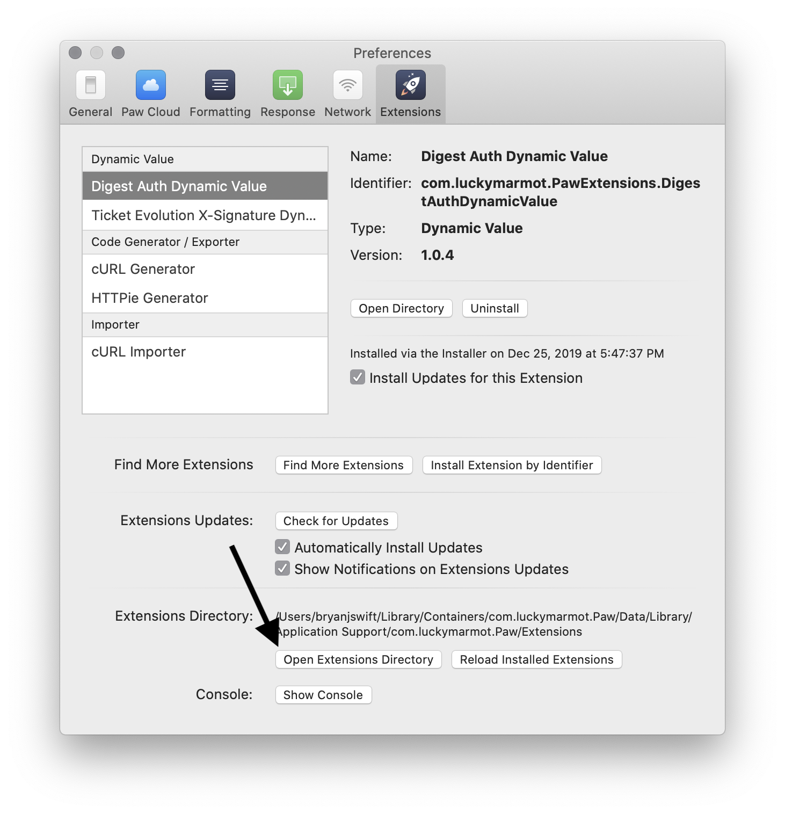
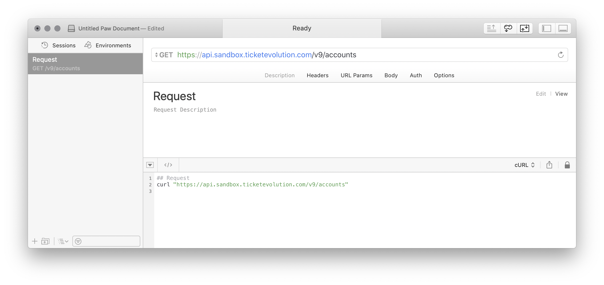
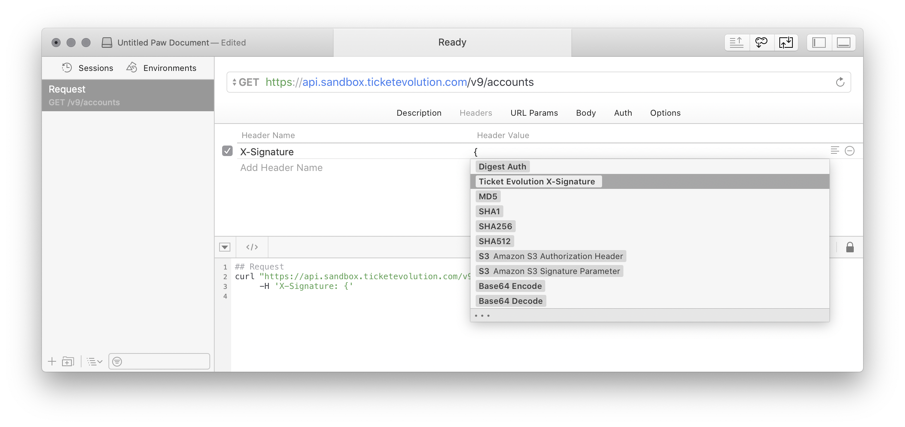
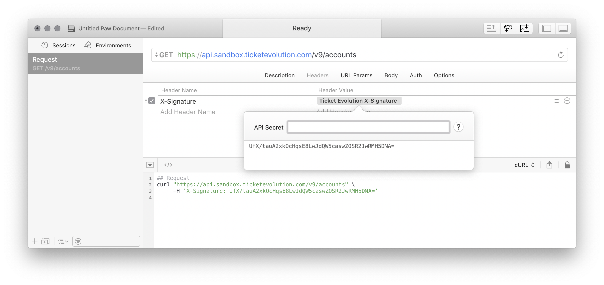
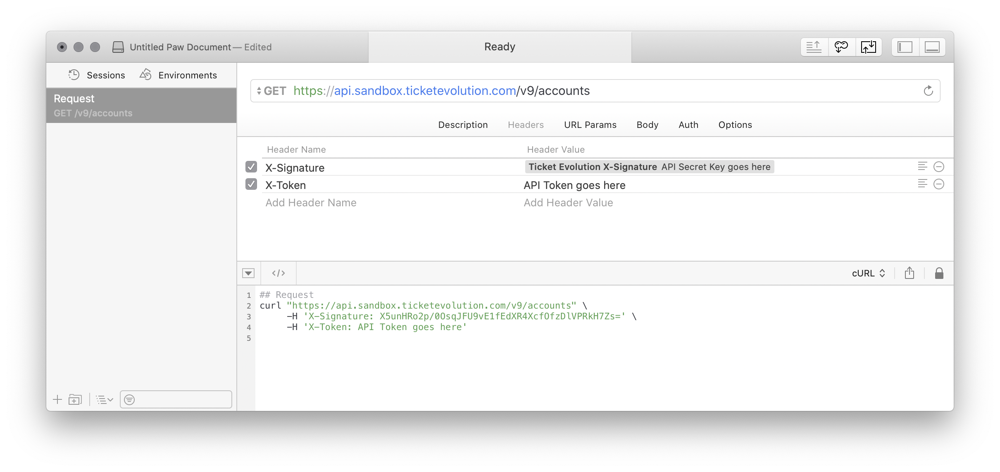

This is an implementation to generate the X-Signature required of the [Ticket
Evolution API][tevo-api] for the [Paw][paw] application.

[tevo-api]: https://ticketevolution.atlassian.net/wiki/spaces/API/pages/983115/Signing+requests+with+X-Signature
[paw]: https://paw.cloud

## Install the Extension

1. Download the [`.zip` archive of the latest version][releases]
1. Open the [Paw][paw] application
1. Open preferences for the Paw application
1. Click on "Extensions" in Paw's preferences
1. Click on the "Open Extensions Directory" button at the bottom of the
  "Extensions" preference pane
   
1. Copy the `.zip` archive of the latest version to the `Extensions` directory
1. Unzip the `.zip` archive which should create a folder named
  `com.bryanjswift.PawExtensions.XSignature`

[releases]: https://github.com/bryanjswift/Paw-TicketEvolutionXSignature/releases/latest

## Use the Extension

1. Create a new request for the Ticket Evolution API
   
1. Add a header with the name `X-Signature`, for the value select "Ticket
   Evolution X-Signature"
   
1. Click on "Ticket Evolution X-Signature" in the "Header Value" column
   
1. Put the API Secret Key use to access the API in the field labeld "API
   Secret"
1. Add a header with the name `X-Token`, Put the API Token use in the "Header
   Value" column for `X-Token`
   

## Development

### Prerequisites

```shell
npm install
```

### Build

Compiles the source files into the JavaScript which can be used by the Paw
application.

```shell
make build
```

### Install

Moves the built files into the local "Application Support" directory for
`com.luckymarmot.Paw`.

```shell
make install
```

### Test

```shell
npm test
```

## License

This Paw Extension is released under the [MIT License](LICENSE). Feel free to
fork, and modify!

Copyright © 2019 Bryan J Swift
